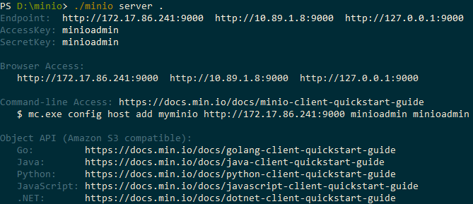

# Leverage Cloud File Storage with MinIO

SystemLink File Service allows you to configure and use the Amazon S3 cloud storage instead of a file share. While NI officially addresses the Amazon S3 cloud storage, the File Service also works with MinIO, a server-side software storage stack that is compatible with Amazon S3.

To use MinIO with SystemLink, you need SystemLink version 2020 R3 or later.

To use MinIO as a storage provider, set up the MinIO server on a system that you would like to upload files to. This can be the same machine as the SystemLink server or an own dedicated server. Then, configure the File Service to use that server.

## Running MinIO server

1. Download the server application from the [MinIO website](https://min.io/download).

2. From the command line, run the following command to run the server:

    ```bash
    minio server <PathToRootFolder>
    ```

    <figure>
    
    <figcaption>Running a minio server.</figcaption>
    </figure>

3. When starting the MinIO server for the first time, use a web browser to connect to the endpoint that the command line prints out. Create a bucket by using the `+` button in the right bottom corner.

    !!! note "Note"
        - It is recommended to set non-default access key and secret key. You can do that by setting the environment variables `MINIO_ACCESS_KEY` and `MINIO_SECRET_KEY`.
        - There's no bucket region necessary for using MinIO, but you have to apply a bucket region for the File Service to work. Just use `us-east-1`.
        - Any of the three endpoints in the first line of the minio server output are usable as `S3BackEndSecretKey` (for localhost given your client is on the same machine as the MinIO server).

For detailed information on how to run the server, follow the instructions from the [MinIO Quickstart guide](https://docs.min.io/docs/minio-quickstart-guide.html).

## Configuring File Service

1. Follow the instructions from [the documentation on uploading files to S3](https://www.ni.com/documentation/de/systemlink/latest/data/uploading-files-to-amazon-s3) to configure the File Service.

2. In addition to that, there are two additional settings required only when using MinIO. Add these settings to the JSON configuration file at `C:\ProgramData\National Instruments\Skyline\Config\FileIngestion.json`:

    - `S3BackEndServiceUrl`: Set this value to ip:port of your MinIO server
    - `S3ForcePathStyle`: Set this value to `True`

    You can paste the example code below to the config file and replace the placeholders with your actuals values.

    ```bash
    "UseS3BackEnd" : "True",
    "S3BackEndBucketRegion" : "us-east-1",
    "S3BackEndBucketName" : "<YourBucket>",
    "S3BackEndAccessKeyId" : "<YourAccessKey>",
    "S3BackEndSecretKey" : "<YourSecretKey>",
    "S3BackEndFolderName" : "",
    "S3BackEndServiceUrl" : "<YourServerIP>",
    "S3ForcePathStyle" : "True"
    ```

3. Restart the entire `NI SystemLink Service Manager`.
