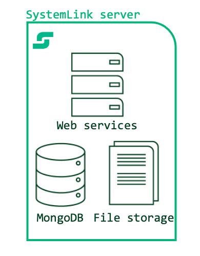
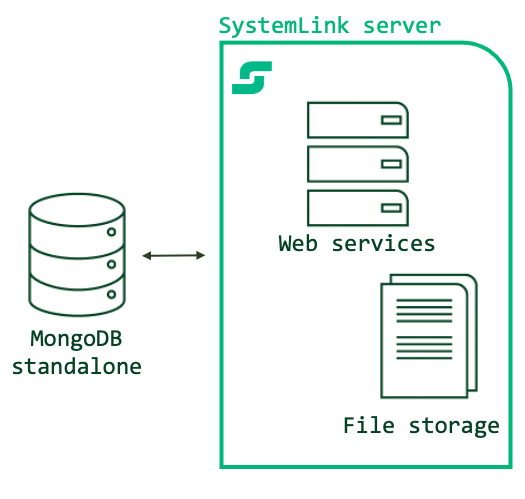

# MongoDB

MongoDB is used by the majority of SystemLink services as the primary datastore. MongoDB Community Edition is included in the default installation of SystemLink will launch when the SystemLink server boots This is referred to as a *single node* deployments. MongoDB can also be hosted on a separate stand-alone server, a replica set of 3 or more servers, or accessed through MongoDB's Platform as a service offering: MongoDB Atlas. This is referred to as a *multi node* deployment.

## Assumptions and Prerequisites

Before you configure a remote MongoDB to use with SystemLink, ensure you have the following

- A server running SystemLink 2021R1 or greater. Refer to Installing and Configuring SystemLink Server and Clients for the basics of setting up a SystemLink server.
- A standalone server running MongoDB, multiple servers hosting a MongoDB replica set, or a MongoDB Atlas Account with a user with the `dbAdmin` or similar role. Refer to [Role-Based Access Control](https://docs.mongodb.com/manual/core/authorization/) for details.

## SystemLink with Single Node vs Multi Node MongoDB Deployments

The following table summarizes when to consider the various supported configurations of MongoDB with SystemLink.

| Diagram | SystemLink + MongoDB Configuration | When to use |
| | ----------- | ----------- |
|| Single node with Defaults     | Here SystemLink and MongoDB are hosted on the same server. Use this configuration when evaluating SystemLink or in small deployments of less than 10 managed nodes without the Asset Manager and Test Insights modules. |
|| Single node with increase index cache   | Here SystemLink and MongoDB are hosted on the same server. Use this configuration when evaluating SystemLink or in moderate deployments of less than 25 managed nodes and moderate usage of the Test Insights module producing less than 100 test steps and results each day.     |
|| Multi node with single standalone MongoDB Instance | Here SystemLink and MongoDB are hosted on two separate servers. Use this configuration when the CPU, memory, and disk consumption is impacting the operation of SystemLink services. Note, while this configuration provides for greater reliability by splitting the servers running SystemLink and MongoDB, it does not provide greater redundancy for data storage.   |
|| Multi node with MongoDB replica sets | Here SystemLink is hosted on a dedicated server and MongoDB is hosted on 3 or more servers. **This is the recommended configuration for all production deployments including small and moderately sized deployments.** This configuration enables greater scale (>50 managed nodes, >1000 test steps and results daily). This configuration provides for greater mitigation of data loss with redundant replica sets. Refer to [MongoDB documentation](https://docs.mongodb.com/manual/tutorial/deploy-replica-set/) for setting up and hosting a MongoDB instance with replica sets. |
|| Multi node with MongoDB Atlas | Here SystemLink is hosted on a dedicated server and connects to a MongoDB Atlas cluster. This is recommended for large scale deployments (>200 managed node, 10,000 test steps and results daily). MongoDB Atlas also simplifies database provisioning, operation, backup and restore. These features may be desireable at any scale of deployment. Refer to [MongoDB Atlas](https://www.mongodb.com/cloud/atlas) for details on this service. |

## Single Node Deployments

By default SystemLink stores all data on databases and the file system hosted on the SystemLink application server. To improve the reliability of data storage and scale to larger volumes of data, remote data stores are recommended for all production deployments.

### Increasing the index cache size for *single node* deployments

Increase the index cache size to process more data and use the Test Insights or Asset Management modules in a single-node deployment. This avoids high CPU usage that can occur with the default MongoDB memory constraints in SystemLink. NI recommends increasing the available memory for the index to 8GB. The following steps can be used to increase the available memory for the MongoDB index.
  
1. With a user with administrator privileges, log into the desktop of the SystemLink app server.
1. Open **NI SystemLink Server Configuration**.
1. Navigate to **NoSqlDatabase**.
1. Under **The NoSqlServer is launched and managed by SystemLink**, adjust the value in **The cache size of the database in Gigabytes (GB)**.
1. Click **Apply**.

!!!note
    Refer to [Sizing a SystemLink server](https://www.ni.com/documentation/en/systemlink/latest/setup/sizing-a-systemlink-server/) for guidance on the CPU, memory, and disk needed for SystemLink single node deployments.

## Connecting to MongoDB in a Multi Node Configuration

SystemLink supports three types of multi-node configuration. You can configure SystemLink to connect to a standalone instance, replica sets, or MongoDB Atlas.While SystemLink can connect and use a sharded MongoDB cluster (`mongos`) it will not take full advantage of the capabilities enabled by sharded clusters.

- NI does not support configurations where the MongoDB instance is used by multiple SystemLink servers.
- NI does not support configurations where the MongoDB instance is also used by another production application.

!!!important
    Due to a bug in the Elixir MongoDB driver, SystemLink cannot connect to MongoDB instances where there is either the `-` or the `_` characters in the MongoDB username provided in the form input or connection string.

### Connecting to Standalone MongoDB instance

You may use the supplied form input in **NI SystemLink Sever Configuration** when connecting to a server hosting a single standalone MongoDB instance. Refer to [Connecting to a Remote Mongo Database](https://www.ni.com/documentation/en/systemlink/latest/setup/remote-mongo-database/) for steps to connect with this method.

### Connecting to MongoDB with Replica Sets

TODO setup a 3 node replica set using community edition.

To successfully connect to a MongoDB replica set you must provide SystemLink a connection string. If you use the form in **NI SystemLink Configuration**, SystemLink will not take advantage of the redundancy provided by replica sets.

1. With a user with administrator privileges, log into the desktop of the SystemLink app server.
1. Open **NI SystemLink Server Configuration**.
1. Navigate to **NoSqlDataBase**.
1. Click the **Connect to an externally managed NoSqlDatabase server** radio button.

    !!!note "Secure remote connections"
        NI recommends securing communications between your SystemLink server and MongoDB instance with TLS. For details, refer to [TLS for Remote MongoDB Instances](/network-security/network-security/#tls-for-remote-mongodb-instances).

1. Select the **Use a custom connection string** checkbox.
1. Enter your connection string. [Refer to Connection String URI Format](https://docs.mongodb.com/manual/reference/connection-string/) for details on structuring your connection string.
1. Click **Test Connection** to ensure SystemLink can connect to the MongoDB instance.
1. If the connection test was successful, click **Apply** to restart SystemLink service manager and connect to the MongoDB instance.

!!!important
    Some connection string formats are unsupported or could cause issues in some environments.

    - Connection strings that contain the query parameter `tls=` are unsupported. Use the `ssl=` query string to achieve the same capability with the same degree of security.
    - The DNS seed list URI format (`mongodb+srv://`) may fail in some environments due to a bug ([Unable to connect to Atlas due to DNS connectivity issues #358](https://github.com/kobil-systems/mongodb/issues/358)) in the Elixir MongoDB driver used by SystemLink. In this case use the [MongoDB standard connection string format](https://docs.mongodb.com/manual/reference/connection-string/#std-label-connections-standard-connection-string-format) to connect your replica set. This affects both self-hosted replica sets and MongoDB Atlas.

### Connecting to MongoDB Atlas

If you have not setup an Atlas cluster before, refer to [Getting started with Atlas](https://docs.atlas.mongodb.com/getting-started/). Refer to [Setup Atlas Connectivity](https://docs.mongodb.com/guides/cloud/connectionstring/) for steps to obtain a connection string.

!!!note "MongoDB Atlas free tier is unsupported by SystemLink"
    Due to constraints on memory in the Atlas free tier, SystemLink will not successfully connect to a cluster running on the free tier. You must use a paid tier to successfully connect. The lowest performance paid tiers of Atlas are supported by SystemLink. If you need assistance evaluating Atlas with SystemLink please contact NI ([customer.requests@ni.com](mailto:customer.requests@ni.com)) or your local account manager.

Because Atlas uses replica sets by default, your SystemLink server could be affected by the bug in the Elixir MongoDB driver used by SystemLink as described in [Connecting to MongoDB with Replica Sets](#connecting-to-mongodb-with-replica-sets). When obtaining a connection string from Atlas use the connection string generated for the Node.js driver version 2.0.14. This provided connection string is fully supported by SystemLink.

TODO mention that RS via x509 is required for MDB RBAB
TODO mention encryption at rest options

## Files

Stub for now. I'm leaning toward this being its own chapter in the data store section.

## DataFinder Index

Stub for now. I'm leaning toward this being its own chapter in the data store section.
