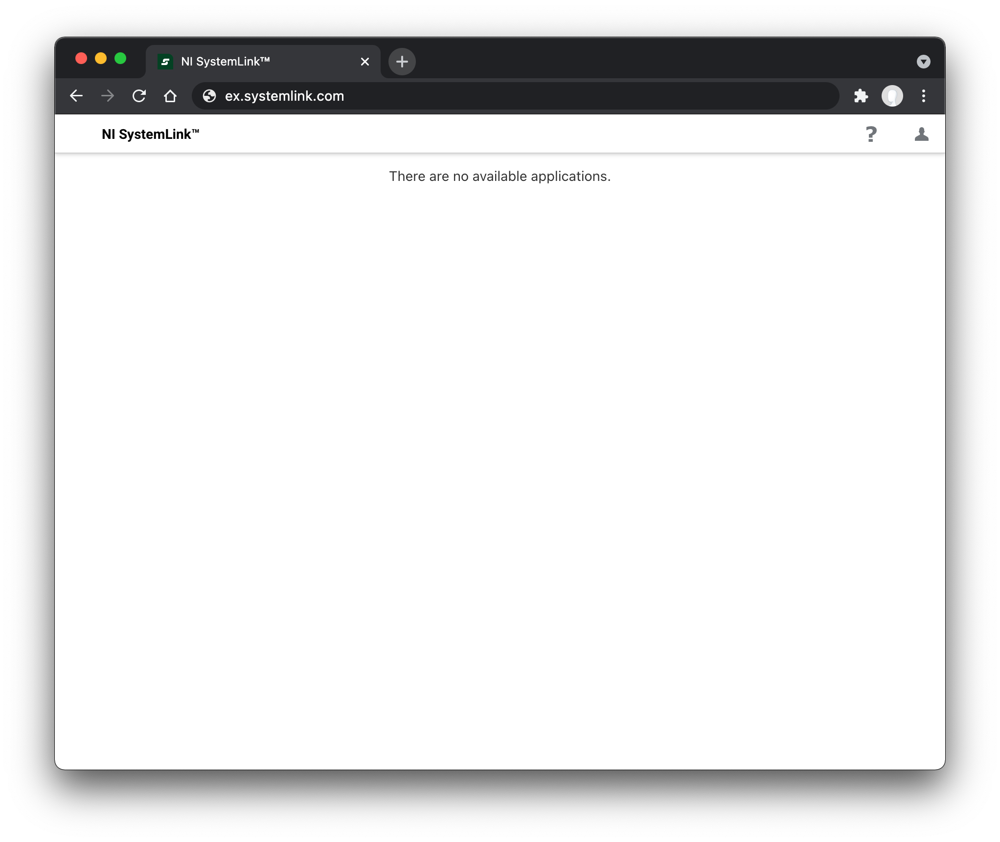

# Sign on with LDAP

You can configure SystemLink to use the Lightweight Directory Access Protocol (LDAP) for user authentication. Use LDAP attributes and groups to map users to roles and workspaces in SystemLink's role based access control system.

## Assumptions and Prerequisites

- A server running SystemLink.
    - Refer to [Installing and Configuring SystemLink Server and Clients](https://www.ni.com/documentation/en/systemlink/latest/setup/configuring-systemlink-server-clients/) for the basics of setting up a SystemLink server.

- Administrator desktop access to the SystemLink server.

- An LDAP server accessible to the SystemLink server.

- A bind user and bind password for the LDAP server.
    - SystemLink supports anonymous connections. In this case the bind user and bind password are not needed.

- Familiarity with the LDAP attributes available to your organization.
    - If you do not know what LDAP attributes and groups are available to you, talk with your LDAP system administrator.
    - Tools such [ADExplorer](https://docs.microsoft.com/en-us/sysinternals/downloads/adexplorer) can be helpful to explore the attributes assigned to your users.

## Enabling LDAP in SystemLink

### Configuring Authentication

1. Log into the server running SystemLink and open **NI Web Sever Configuration**.

2. Go to the **Authentication** tab and enable **Connect to an LDAP server**.

3. Enter the LDAP URL for your sever. Refer to [**LDAP URLs**](#ldap-url) for details on how to structure this URL.

4. Enter the bind user. Refer to [**Bind User**](#bind-user) for details on usernames that can be used here.

5. Enter the bind password.

6. Click **Apply and Restart**.

<figure>
  
  <figcaption>Configuration needed to enable logging into a SystemLink server using LDAP credentials.</figcaption>
</figure>

You may now log in to the SystemLink server using your LDAP credentials. To access systems and data in SystemLink, configure workspace and role mappings. Refer to [**Mapping LDAP Attributes and Groups to SystemLink Workspaces and Roles**](#mapping-ldap-attributes-and-groups-to-systemlink-workspaces-and-roles) for details.

<figure>
  
  <figcaption>View from a user who can log in but does not have any workspace and role mappings.</figcaption>
</figure>

## LDAP URL and Bind User

You must provide a URL and bind user and bind password to establish an authenticated connection between your SystemLink server and LDAP server.

### LDAP URL

The LDAP URL follows a standard scheme.

!!! note "URL Scheme"
    `<ldap>://<server-dns>:<port>/<target-entry-dn>?<username-attribute>?<scope>?<filter>`

**protocol:** `ldap` or `ldaps` for secure connections. SystemLink does not support STARTTLS, which allows connections over non-TLS and then initiates a TLS handshake.

**server-dns:** The LDAP server SystemLink is connecting to.

**port:** The port of the LDAP server. If your LDAP server is backed by Windows Active Directory, you may point to the global catalog on port 3268 to enable login from multiple domains (forest).

**target-entry-dn:** The base search distinguished name (DN) for the LDAP directory.

**user-name-attribute:** The attribute that determines the SystemLink username for login.

**scope:** The **scope** of the directory search. Scope defaults to `sub` but can be set to `one` to restrict users to the base DN.

**filter:** The LDAP search filter. This defaults to `objectClass=*` to find find all objects in the directory. This allows you to restrict login to users who have a specific attribute.

!!! note "Basic LDAP URL Example"

    **Example:** `ldap://example.com:389/dc=example,dc=com?sAMAccountName`

    In this example the server is `example.com`, the port is 389, the base search DN is `dc=example,dc=com` and the LDAP attribute used for user login is `sAMAccountName`.

!!! note "Example LDAP URLs specifying different usernames for the user Jane Doe"

    **URL:** `ldap://example.com/dc=example,dc=com?sAMAccountName`
    **Username:** jdoe

    **URL:** `ldap://example.com/dc=example,dc=com?userPrincipalName`
    **Username:** jane.doe@example.com

    <figure>
      
      <figcaption>Username `jdoe` is used because the `sAMAccountName` attribute is specified in the LDAP URL.</figcaption>
    </figure>

If a username attribute is not specified **NI Web Server Configuration** will automatically add `uid` as the attribute. Depending on your LDAP directory setup this attribute may not be available.

### Bind User

The bind user and bind password are used to authenticate with the LDAP server. Provide a `distinguishedName` or a `userPrincipalName` to specify the bind user. If the password for this user changes, **NI Web Server Configuration** must be updated for users to continue to log into SystemLink.

!!! note "Bind user formats for the user Jane Doe"
    **distinguishedName:** cn=jdoe,dc=example,dc=com

    **userPrincipalName:** jane.doe@example.com

## Mapping LDAP Groups, Users, and Attributes to Workspaces and Roles

To add a user or collection of users to a workspace and assign a role you must complete the role mapping workflow.

1. Log in to the SystemLink web application with a user mapped to the [**Server Administrator**](https://www.ni.com/documentation/en/systemlink/latest/setup/predefined-roles/) role.

2. Go to **Access Control** > **Workspaces** and click the gear icon in the top right.

3. Create a new workspace or edit an existing workspace.

4. Go to the **Role Mappings** tab.

5. Click **+MAPPING** and select one of the available LDAP mapping types: *LDAP Group*, *LDAP User*, or *LDAP Attribute*.

6. If you have have selected *LDAP Attribute* enter a valid key and value. For *LDAP User* or *LDAP Group* enter a valid value.

### LDAP Group Mapping

LDAP Group mapping queries the `objectClass` of `group` (Active Directory specific), `groupOfName`, and `groupOfUniqueNames` to match either `member` or `uniqueMember` attributes of the group.

!!! note Group names should be declared using the full LDAP `distinguishedName` of the group.
    cn=Users,dc=example,dc=com

### LDAP User Mapping

You may specify a LDAP username when creating workspace and role mappings. The username you specify is the same as the usernames for logging into SystemLink.

### LDAP Attribute Mapping

You can use any available LDAP attribute to create a workspace and role mapping. In this case both the name and value of the attribute must match exactly for the mapping to be successful.

!!! note "Example LDAP attribute mapping"
    <figure>
      
      <figcaption>Mapping the country attribute `c` with the value `US` to the **Data Maintainer Role** in the **Default** workspace.</figcaption>
    </figure>
