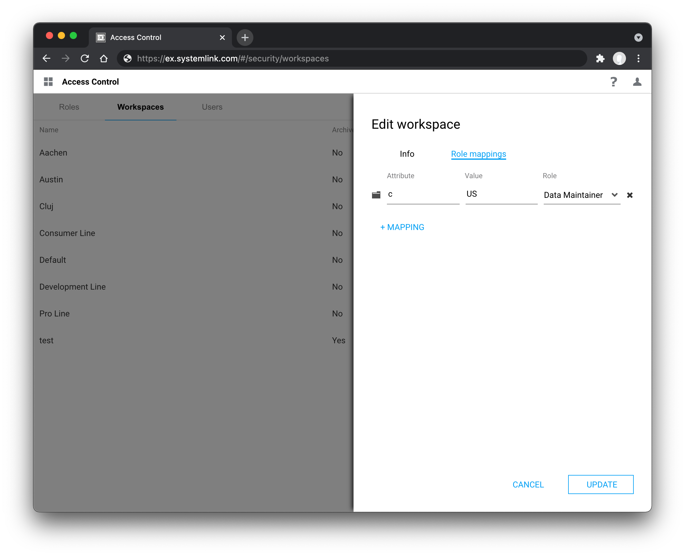

# Sign on with LDAP

You can configure SystemLink to use the Lightweight Directory Access Protocol (LDAP) for user authentication. USe LDAP attributes and groups to map users to roles and workspaces in SystemLink's role based access control system.

## Assumptions and Prerequisites

- A server running SystemLink. Refer to [Installing and Configuring SystemLink Server and Clients](https://www.ni.com/documentation/en/systemlink/latest/setup/configuring-systemlink-server-clients/) for the basics of setting up a SystemLink server.

- Administrator desktop access to the SystemLink server.

- An LDAP server accessible to the SystemLink server.

- A bind user and bind password for the LDAP server.

- Familiarity with the LDAP attributes available to your organization. If you do not know what LDAP attributes and groups are available to you, talk with your LDAP system administrator.
    - Tools such [ADExplorer](https://docs.microsoft.com/en-us/sysinternals/downloads/adexplorer) can be helpful to explore the attributes assigned to your users.

## Enabling LDAP in SystemLink

### Configuring Authentication

1. Log into the server running SystemLink and open **NI Web Sever Configuration**.

2. Go to the **Authentication** tab and enable **Connect to an LDAP server**.

3. Enter the LDAP URL for your sever. Refer to [**LDAP URLs**](#ldap-urls) for details on how to structure this URL.

4. Enter the bind user. Refer to [**Bind User**](#bind-user) for details on usernames that can be used here.

5. Enter the bind password.

6. Click **Apply and Restart**.

<figure>
  
  <figcaption>Configuration needed to enable logging into a SystemLink server using LDAP credentials.</figcaption>
</figure>

You may now login to the SystemLink server using your LDAP credentials. Please note that you will not be able to access systems and data in SystemLink unless you have configured workspace and role mappings. Refer to [**Mapping LDAP Attributes and Groups to SystemLink Workspaces and Roles**](#mapping-ldap-attributes-and-groups-to-systemlink-workspaces-and-roles) for details.

<figure>
  
  <figcaption>View from a user who can login but does not have any workspace and role mappings.</figcaption>
</figure>

## LDAP URLs

LDAP URLs follow a standard scheme. The URL determines the server to connect to, the server's port, a base search distinguished name (DN), and an attribute that determines what users will provide as a username when logging into SystemLink.

!!! note "Example LDAP URL and login window"

    **Structure:** `ldap://<server-dns>:<port>/<target-entry-dn>?<username-attribute>`

    **Example:** `ldap://example.com:389/dc=example,dc=com?sAMAccountName`

    In this example the server is `example.com`, the port is 389, the base search DN is `dc=example,dc=com` and the LDAP attribute used for user login is `sAMAccountName`. 

    <figure>
      
      <figcaption>Username `jdoe` is used because the `sAMAccountName` attribute is specified in the LDAP URL.</figcaption>
    </figure>

If a username attribute is not specified **NI Web Server Configuration** will automatically add `uid` as the attribute. Depending on how your LDAP directory is setup this attribute may or may not be available.

!!! note "Common username attributes"
    - `uid`
    - `userPrincipalName`
    - `sAMAccountName`

## Bind User
The bind user and bind password are used to authenticate with the LDAP server. The bind user can be specified by providing either a `distinguishedName` or a `userPrincipalName`.

!!! note "Bind user formats for the user Jane Doe"
    **distinguishedName:** cn=jdoe,dc=example,dc=com

    **userPrincipalName:** jane.doe@example.com

## Mapping LDAP Attributes and Groups to SystemLink Workspaces and Roles

To add a user or collection of users to a workspace and assign a role you must complete the role mapping workflow.

1. Log in to the SystemLink web application with a user mapped to the [**Server Administrator**](https://www.ni.com/documentation/en/systemlink/latest/setup/predefined-roles/) role.

2. Go to **Security** > **Workspaces** and click the gear icon in the top right.

3. Create a new workspace or edit an existing workspace.

4. Go to the **Role Mappings** tab.

5. Click **+MAPPING** and select one of the available LDAP mapping types: *LDAP Group*, *LDAP User*, or *LDAP Attribute*.

6. If you have have selected *LDAP Attribute* enter a valid key-value. For *LDAP User* or *LDAP Group* enter a valid value.

### LDAP Group Mapping

The LDAP Group mapping looks for the values in the LDAP `memberOf` attribute. This attribute's value is an array of group DNs. The value provided to SystemLink must exactly match one value available in the `memberOf` attribute array.

### LDAP User Mapping

Similar to the LDAP attribute that determines what users use for their username during login, the value for LDAP user mapping must match the user ID attribute specified in the LDAP URL.

!!! note "Example LDAP user mappings with different LDAP URLs for the user Jane Doe"

    **URL:** `ldap://example.com/dc=example,dc=com?sAMAccountName`
    **LDAP User:** jdoe

    **URL:** `ldap://example.com/dc=example,dc=com?userPrincipalName`
    **LDAP User:** jane.doe@example.com

### LDAP Attribute Mapping

You can use any available LDAP attribute to create a workspace and role mapping. In this case both the name and value of the attribute must match exactly for the mapping to be successful.

!!! note "example LDAP attribute mapping"
    <figure>
      
      <figcaption>Mapping the country attribute `c` with the value `US` to the **Data Maintainer Role** in the **Default** workspace.</figcaption>
    </figure>
