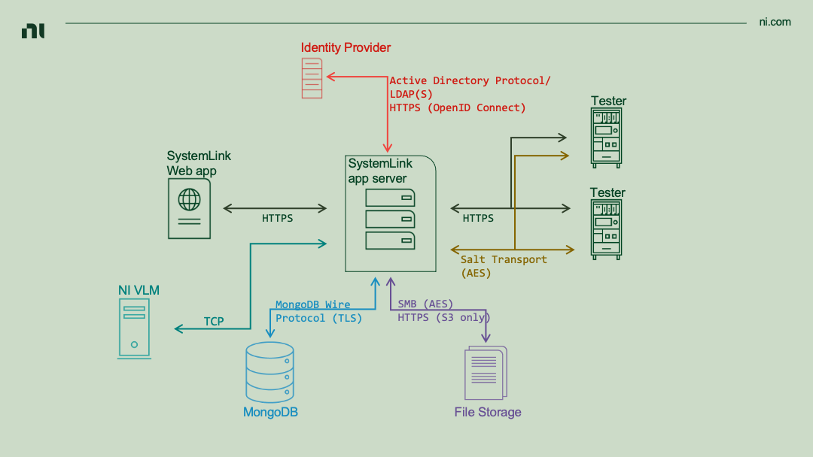

# Network Security

SystemLink connects test systems to a central server to aggregate data for monitoring and analysis. SystemLink uses industry standard tools and best practices to ensure the SystemLink server and test systems utilize secure networking techniques.

Refer to [Workspaces and Role-based Access Control](/rbac/rbac) for details secure user interactions with SystemLink resources. Refer to [Single Sign-on with OpenID Connect](/openid-connect/openid-connect/) and [Sign on with LDAP](/ldap/ldap/) for details on securely authenticating with SystemLink.

## Summary of SystemLink Network Security Best Practices

- Use firewalls to restrict open ports to only those needed by your environment.

    - Do not expose Salt ports on the SystemLink server to the public internet.

- Configure NI Web Server to use HTTPS.

- Disable Cross Origin Resource Sharing.

- Use LDAPS for communication between your SystemLink server and LDAP server.

- Use HTTPS for communication between your SystemLink server and OpenID Connect provider.

- If using a remotely connected MongoDB instances, configure this instance to use TLS communication.

- Disable AMQP for client access.

- Use a network load balancer to mitigate against Denial of Service (DoS) threats.

## Network diagram

<figure>
  
  <figcaption>The networked components and encrypted protocols used by SystemLink.</figcaption>
</figure>

!!! note
    Refer to [Setting up a SystemLink Server](https://www.ni.com/documentation/en/systemlink/2020r4/setup/setting-up-systemlink-server/) for information regarding ports used by SystemLink.

    Although AMQP is enabled by default it is not shown. Refer to [Deprecation of AMQP for details](#deprecation-of-amqp). 

- **SystemLink Application Server**:
    - This Windows server hosts NI Web Server, the various SystemLink web services, SystemLink web applications, and a Salt master.
    - In the *single-box* setup, MongoDB and SystemLink file service storage are hosted on the application server.
    - Refer to [Sizing a SystemLink Server](https://www.ni.com/documentation/en/systemlink/2020r4/setup/sizing-a-systemlink-server/) for details on server system requirements.
    - Securing desktop access to the application server is outside the scope of this document. Configure server access according to the IT policies of your site.

- **SystemLink Web Application**
    - The SystemLink web application is the primary way users interact with SystemLink.
    - NI recommends HTTPS for all production environments.
    - Refer to [**NI Web Server**](#ni-web-server) for details on configuring encrypted communication.

- **Targets**
    - Targets are Windows and Linux RT systems whose software and configuration are managed by SystemLink.
    - Software configuration occurs via the [SaltStack Transport Protocol](https://docs.saltproject.io/en/latest/topics/transports/).
        - Refer to [**Target to SystemLink Communication**](#target-to-systemlink-communication) for details regarding how SystemLink encrypts this communication.
    - File, tag, test, and asset data are published to the SystemLink application server over HTTPS.

- **MongoDB**
    - MongoDB is the primary database used by SystemLink's web services.
    - The [MongoDB wire protocol](https://docs.mongodb.com/manual/reference/mongodb-wire-protocol/) is used to communicate with the MongoDB instance.
    - Refer to [TLS for Remote MongoDB Instances](#tls-for-remote-mongodb-instances) for details on enabling TLS communication.

- **File Service Storage**
    - The SystemLink file service can be configured to store files on either Network Attached Storage (NAS) or AWS S3.
    - NAS uses the SMB protocol.
        - The SMB protocol can be configured to use AES encryption. Refer to [SMB security enhancements](https://docs.microsoft.com/en-us/windows-server/storage/file-server/smb-security) for details and steps to secure this transport.
    - AWS S3 uses HTTPS.
        Refer to the [SystemLink manual](https://www.ni.com/documentation/en/systemlink/latest/data/uploading-files-to-amazon-s3/) for steps to enable S3 file storage.

- **DataFinder (not shown)**
    - DataFinder enables indexing and searching for files stored on network drives.
    - DataFinder's network communication cannot be secured with TLS.

- **Identity Provider**
    - Active Directory, LDAP, and OpenID Connect are supported identity providers.
        - Local Windows accounts may also be used (not shown).
        - Active Directory uses the Active Directory protocol.
        - LDAP uses the ldap or the ldaps protocols.
    - Refer to [Sign-on with LDAP](/ldap/ldap/). and [Single Sign-on with OpenID Connect](/openid-connect/openid-connect/) for details on setting up these identity providers.

- **NI VLM**
    - NI Volume License Manager (VLM) is used to enforce SystemLink node licenses.
    - NI VLM uses TCP and does not support encrypted communication.
    - Refer to [Licensing SystemLink Products](https://www.ni.com/documentation/en/systemlink/2020r4/setup/licensing-systemlink/) for details on using VLM with SystemLink.

## NI Web Server

NI Web Server is based on [**Apache httpd**](https://httpd.apache.org) and includes the **NI Web Server Configuration** utility to guide the selection of secure presets as well as a GUI for setting underlying Apache httpd configurations.

!!! note
    NI Web Server ships with SystemLink and various other NI software products such as LabVIEW.

    Refer to the [NI Web Server manual](https://www.ni.com/documentation/en/ni-web-server/latest/manual/manual-overview/) for step by step instructions to configure your web server.

### HTTPS in NI Web Server

NI Web Server supports TLS 1.3.

**NI Web Server Configuration** supports creating self-signed certificates, certificate signing requests (CSR), and installing certificates generated by a certificate authority. The DNS settings for the server can affect the operability of these certificates. Refer to [**DNS Configuration**](#dns-configuration) for details. NI recommends including the fully qualified domain (FQDN) name for your SystemLink Server in either the common name or subject alternative name of your certificate.

!!! warn
    Self-signed certificates should be used for testing purposes only.

!!! note "Limited capabilities when using self-signed certificates"

    Clients will not trust self-signed certificates by default. This can prevent some operations from occurring.

    - Web browsers will not trust the certificate and the user must grant an exception to load the SystemLink web application.

    - Packages built in LabVIEW cannot be [automatically published](https://www.ni.com/documentation/en/systemlink/latest/deployment/creating-packages-labview-package-builder/) to the SystemLink server.

    - The LabVIEW Client API must explicitly disable verify server checks to communicate with the server.
        - Refer to [Open Configuration](https://www.ni.com/documentation/en/systemlink/latest/systemlink-labview-node-ref/open-configuration-http-auto/) for details on this setting.

When you have received a certificate from an certificate signing authority, you can use **NI Web Server Configuration** to install the certificate.

1. Open **NI Web Sever Configuration** and navigate to the **HTTPS** tab.

1. Click the **Use a certificate from a signing authority** radio button.

1. Expand the **Install an already signed certificate** section.

1. Click the folder icon next to **Certificate file** and browse to your certificate file.

1. Click the folder icon next to **Key file** and select your key file.

1. Click the Enable HTTP Strict Transport Security checkbox to include the [Strict-Transport-Security header](https://developer.mozilla.org/en-US/docs/Web/HTTP/Headers/Strict-Transport-Security) in all responses sent by this server. This is strongly recommended but not required.

1. If needed change the HTTPS port from the default, 443.

1. Click **Apply and restart**.

!!! note "TLS certificates with application load balancers"
    If you have a load balancer in front of your SystemLink application server you must ensure the same certificate is installed on both the load balancer and NI Web Server for targets to successfully connect and publish data to SystemLink.

#### Specifying custom Diffie-Helman parameters

The TLS protocol typically uses the [Diffie-Hellman key exchange algorithm](https://en.wikipedia.org/wiki/Diffie%E2%80%93Hellman_key_exchange) as part of its connection handshake. The Diffie-Hellman algorithm requires the server to provide a prime number as an input to the algorithm. By default, NI Web Server uses a set of default prime values defined by the Apache Web Server for this purpose. This approach is sufficient for many use cases, but, when additional security is required, a custom value can be provided in place of the defaults.

These instructions use the copy of OpenSSL installed with SystemLink 23.5 or later. A different copy of OpenSSL can be substituted if desired.

1. Open a command prompt on the SystemLink Server machine.

1. Run

        "c:\Program Files\National Instruments\Shared\Skyline\OpenSSL\openssl.exe dhparam -outform PEM -out dhparam.txt <numbits>

    The `<numbits>` value specifies a bit length for the prime. The bit length must be one of 1024, 2048, 3072, 4096, 7680, or 8192 bits. A length of at least 3072 bits is [strongly recommended](https://www.keylength.com/en/4/).

1. OpenSSL will run for some time and produce a file called `dhparam.txt` in the current directory. Open this file in Notepad or another preferred text editor.

1. Run Notepad as an administrator. Open the NI Web Server certificate. This file is located at `C:\Program Files\National Instruments\Shared\Web Server\certs\`. The actual name of the certificate file will vary per deployment.

1. Copy the entire contents of dhparam.txt.

1. Scroll to the end of the certificate file.

1. Paste the dhparam contents on the line after the final `-----END CERTIFICATE-----` line.

1. Save and close the certificate file.

1. Open **NI Web Sever Configuration** and navigate to the **Control** tab.

1. Click the **Restart** button and wait for the server to restart.

!!! note
    Longer parameters will increase the computational cost of handling each TLS connection to the server. Additionally, older TLS client applications may not support longer keys. Testing should be performed prior to deployment to production.

!!! warn
    This process must be repeated any time you update the configured HTTP certificate in the **NI Web Sever Configuration** tool.

### DNS Configuration

SystemLink and NI Web Server do not ship with a DNS server. NI assumes you will provide a DNS server for your environment. NI Web Server will provide a default for the DNS of your SystemLink server based on Windows OS settings. Other valid DNS names are listed in the **Preferred host name for generated URLs and certificates** combo box. You may also manually add hostnames as needed. As the name of the combo box implies, this setting must match the host name in your TLS certificates. If you are using OpenID Connect this DNS must also be used in your [OpenID Connect redirect URI configuration](/openid-connect/openid-connect/#setting-login-redirect-uri). If an invalid hostname is provided data from managed targets will not be received by SystemLink.

### Cross Origin Resource Sharing and Remote Connections

NI recommends disabling Cross Origin Resource Sharing (CORS) in production environments. In practice, CORS may need to be enabled to facilitate workflows for users developing web applications that interact with SystemLink's API. For this scenario, NI recommends setting up a *test* SystemLink server with CORS enabled.

NI Web Server Configuration exposes settings for choosing a remote connection and automatically sets Windows Firewall rules. This ensures connections may only be established by clients on your preferred network.

Refer to [Choosing Remote Settings](https://www.ni.com/documentation/en/ni-web-server/latest/manual/choosing-a-remote-setting/) for details on the various CORS and remote connection settings.

## Target to SystemLink communication

Test Systems communicate with SystemLink over HTTP(S) and the SaltStack TCP protocol. Regardless of protocol, All communication is initiated by the test system to the server. Refer to the SystemLink manual for prerequisites and steps to add a [Linux RT]((https://www.ni.com/documentation/en/systemlink/latest/setup/setting-up-systemlink-client-linux/)) or [Windows](https://www.ni.com/documentation/en/systemlink/latest/setup/setting-up-systemlink-client-windows/) target to your SystemLink server.

Data published over HTTPS includes tags, files, assets, and test results. Salt jobs and pillars communicate over the AES encrypted Salt TCP transport. Salt jobs are used for installing software and changing target configuration from SystemLink server. Salt pillars are used to transfer credentials and certificates. The certificates used on the SystemLink server and target nodes are managed by Salt and do not require administrators to explicitly manage these certificates. Refer to SaltStack's [documentation](https://docs.saltproject.io/en/getstarted/system/communication.html) for an overview of the Salt TCP Transport.

!!! note "Managed NI LinuxRT Nodes"
    NI recommends assigning a strong password for the *admin* user on the target. These credentials are required to SSH into the target. These credentials are also required when a SystemLink server adds a Linux RT target to its collection of managed systems.

When a target is approved by SystemLink and becomes a managed node, SystemLink securely transfers configuration, certificates, and credentials needed to authenticate with the SystemLink server's [role-based access control system](/rbac/rbac/). SystemLink client APIs include an [Auto configuration VI](https://www.ni.com/documentation/en/systemlink/latest/systemlink-labview-node-ref/open-configuration-http-auto/) that automatically consumes these credentials. This prevents the need to include credentials and other secrets in your test application code.

!!! warn "Do not expose Salt ports to the public internet"

    Due to the capabilities of Salt, users should configure firewalls and appropriate CIDR blocks to prevent exposing Salt ports (4505 and 4506) to the public internet.

## TLS for remote MongoDB Instances

MongoDB support TLS connections. Refer to the [MongoDB manual](https://docs.mongodb.com/manual/tutorial/configure-ssl/) for details on enabling TLS. NI recommends enabling TLS for remote MongoDB connections.

!!! note

    SystemLink does not support `mongod` instances configured with [client certificate validation](https://docs.mongodb.com/manual/tutorial/configure-x509-client-authentication/). Ensure your `mongod` is started without this requirement to allow SystemLink to successfully connect.

### Connecting to MongoDB Using Self-signed certificates

!!! warn MongoDB with self-signed certificates
    Self-signed certificates should be used for testing purposes only.

Refer to the [MongoDB manual](https://docs.mongodb.com/manual/appendix/security/appendixA-openssl-ca/) for steps to create and run `mongod` with a self-signed certificate. The following refers to certificate names created by following MongoDB's documentation.

!!! note "Running MongoDB without Client certificate validation"

    Option 1: Start `mongod` with command line arguments
    ```bash
    mongod --tlsMode requireTLS --tlscertificateKeyFile /etc/ssl/test-server1.pem --port 27017 --dbpath /var/lib/mongo --bind_ip_all
    ```

    Option 2: Start `mongod` with a Mongo Configuration file
    ```yaml
    net:
        port: 27017
        bindIp: 0.0.0.0
        tls:
            mode: requireTLS
            certificateKeyFile: /etc/ssl/test-server1.pem
    systemLog:
        destination: file
        logAppend: true
        path: /var/log/mongodb/mongod.log
    storage:
        dbPath: /var/lib/mongo
        journal:
            enabled: true
    processManagement:
        fork: true  # fork and run in background
        pidFilePath: /var/run/mongodb/mongod.pid  # location of pidfile
        timeZoneInfo: /usr/share/zoneinfo
    ```

### Installing MongoDB Self-Signed certificates

If you are using a self-signed certificate on your `mongod` instance you must install the certificate authority (CA) certificate and intermediary certificate into the SystemLink application server.

1. Copy the CA and intermediary `.crt` files to your SystemLink application server.

2. Double click on the CA certificate and click **Install certificate...**.

    !!! note
        If you are following the [MongoDB manual appendix](https://docs.mongodb.com/manual/appendix/security/appendixA-openssl-ca/) this file is named `mongodb-test-ca.crt`.

3. In the **Store Location** field select the **Local Machine** radio button and click **Next**.

4. Select the **Place all certificate in the following store** radio button.

5. Click **Browse**, select **Trusted Root Certificate Authorities** and click **OK**.

6. Click **Next**, review the settings, and click **Finish** to install the certificate.

7. Double click on the intermediary certificate and click **Install certificate...**.

    !!! note
        If you are following the [MongoDB manual appendix](https://docs.mongodb.com/manual/appendix/security/appendixA-openssl-ca/) this file is named `mongodb-test-ia.crt`.

8. In the **Store Location** field select the **Local Machine** radio button and click **Next**.

9. Select the **Place all certificates in the following store** radio button.

10. Click **Browse**, select **Intermediate certificate Authorities** and click **OK**.

11. Click **Next**, review the settings, and click **Finish** to install the certificate.

!!! note
    Ensure **Use Transport Layer Security (TLS) encryption** is enabled in the **NoSqlDatabase** section of the **SystemLink Server Configuration** application.

## Deprecation of AMQP

AMQP as a transport protocol for target-to-server communication is deprecated in favor for HTTP(S). NI recommends disabling AMQP on the server and updating test applications to use the HTTP version of SystemLink APIs.

1. Open **NI SystemLink Server Configuration**.

2. Go to **Security**.

3. Uncheck **Enable AMQP client access (less secure)**.
