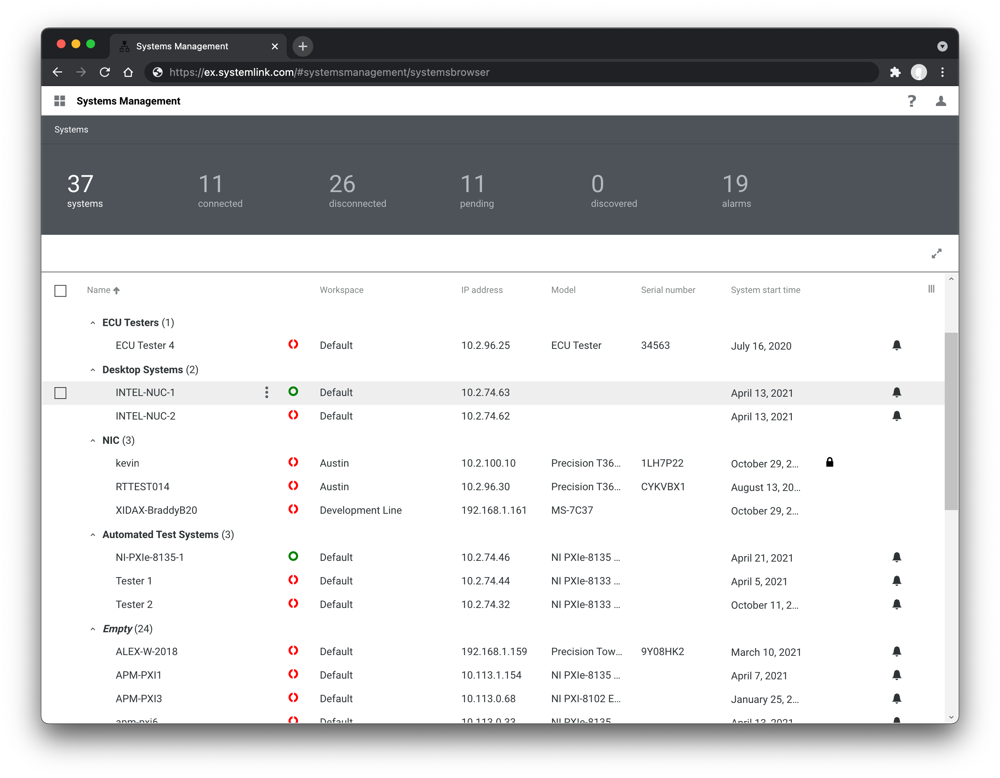

# Workspaces and Role-based Access Control

The SystemLink role-based access control (RBAC) system provides strong isolation between different *workspaces* as well as fine grain privileges for systems, data, and analysis routines in SystemLink. Collectively this capability allows access to SystemLink to scale user and data access beyond a single team to an entire organization.

## Concepts and Design

SystemLink RBAC leverages common concepts such as *roles* and *users*. It also introduces concepts such as *workspaces* and *automatic data encapsulation* to ensure strict access control of data produced by test systems.

<figure>
    
    <figcaption>Role-based access control concepts in SystemLink</figcaption>
</figure>

### Workspace

A workspace is a complete encapsulation of all systems, data, and other resources within SystemLink. A user must be a member of a workspace to access the systems and data within the workspace. This is true for access via the SystemLink web application and the SystemLink REST API. The SystemLink Advanced Server license is required to create multiple workspaces, but there is no limit on the number of workspaces that can be created. If a user is a member of multiple workspaces, resources from each workspace are displayed within the grids, dashboards, and other data views throughout SystemLink.

<figure>
    
    <figcaption>Two workspaces with unique resources in each workspace. Resources users can access are determined by their workspace membership. The actions a user can take on each resource is determined by their role.</figcaption>
</figure>

Systems, data, and analysis routines (collectively referred to as resources) are unique to individual workspaces. No resource occupies multiple workspaces. Some resources may be moved between workspaces. If a resource is duplicated the user is prompted to choose a workspace for the new resource.

!!! note "Special Considerations for DataFinder"

    DataFinder instances are global (meaning any user can view the DataFinder instance), but DataFinder Search Areas defined within a DataFinder instance are scoped to a single workspace. Search areas can only index File Ingestion Service data for the DataFinder Search Area's corresponding workspace.

### Archived Workspaces

Workspaces may be archived if they are no longer in use. Archival does not delete resources or move resources to a new database or file storage location. Archived workspaces are only accessible to users with the [**Server Administrator**](#server-administrator-role) role. Resources in archived workspaces cannot be created, updated, or deleted. Resources may be duplicated or moved into a non-archived workspace. All active alarms are automatically cleared when a workspace is archived.

### Users and Roles

Users, systems, and analysis procedures are assigned roles within the context of a workspace. Roles grant privileges that allow access to the various SystemLink applications and the data exposed by those applications. Privileges explicitly grant what you *can* do - there are no *deny* privileges. Due to this a user may be assigned multiple roles within a single workspace that collectively describe what the user has access to. This is useful to prevent the proliferation of multiple different roles that have similar privileges. Instead, simple roles may be defined and composed together by assigning a user each role.

!!! note "Allow all privileges"

    In each area of available privileges there exists a special privilege: **Allow all privileges**. This privilege automatically grants all privileges for that area. New privileges may be added to new releases of SystemLink. If a new privilege is added users with **Allow all privileges** will automatically be granted the new privilege upon upgrade. If this behavior is undesirable, refrain from using **Allow all privileges**.

    <figure>
        
        <figcaption>All privileges for an area are granted with Allow all privileges is checked</figcaption>
    </figure>

#### Built-in and Custom Roles

Roles define the privileges a user may take against resources within SystemLink. While a user has a role within the context of a workspace a role is defined globally. This enables the same role to be used across multiple workspaces.

When creating and assigning roles, it is best practice to provide users with the minimum number of privileges to perform their work. SystemLink has granular privileges for services and application in the product. These privileges also include access to individual SystemLink applications such as **Systems Manager** and **Test Monitor**.

!!! note
    If a user has a role that grants access to an application in any workspace that application will be available to the user at all times. If a user has not been granted access to an application in any workspace that application will be hidden from the navigation menu.
    
    The privilege to access a web application is not sufficient for to view, list, create, modify, or delete resource exposed by the web application. Additional privileges for those resources must be granted.

Custom roles may be created, duplicated, modified, and deleted as needed. If a role is updated all users mapped to that role are affected.

Due to the large number of privileges available SystemLink includes several *built-in* roles to facilitate getting started. Go to the SystemLink **Security** application to review the details on privileges granted for each role. Refer to the [SystemLink manual](https://www.ni.com/documentation/en/systemlink/latest/setup/predefined-roles/) for a summary of these roles.

!!! note
    Built in roles cannot be modified. They can be duplicated and the duplicated roles may be renamed and the privileges modified. This constraint exists because NI may add or change privileges for built-in roles between releases. Users assigned these built-in roles will have their privileges automatically change upon upgrade. To opt out of this behavior assign your users custom roles.

#### Server Administrator Role

SystemLink includes a special **Server Administrator Role**. This role has exclusive access to the **Security** application and can modify workspaces and roles. This role has full access to all of SystemLink, its applications, data, systems, etc. **for every workspace**. This is the most permissive role in SystemLink and should be used by users who administer access control for SystemLink.

The user *admin* created during the guided setup of **NI Web Server Configuration** is automatically assigned the **Server Administrator** role. This is done such that administrators can access the **Security** application during initial setup and configure access control via an identity provider. NI encourages disabling the *admin* user in the **NI Web Server Configuration** after you have assigned the **Server Administrator** role to users backed by your identity provider.

<figure>
  
  <figcaption>NI encourages disabling the "Login as users controlled by the web server" checkbox after mapping Server Administrators from your identity provider.</figcaption>
</figure>

Users are mapped the **Server Administrator** role by clicking the gear icon in the top right of the **Roles** tab in the **Security Application**.

<figure>
  
  <figcaption>Click the gear icons to configure mappings for the Server Administrator role</figcaption>
</figure>

<figure>
  
  <figcaption>Mappings for users assigned the Server Administrator role</figcaption>
</figure>

#### Users

User's are backed by an identity provider (IdP) such as LDAP, Active Directory, or OpenID Connect that provides authenticated access to SystemLink. This is in contrast to systems and analysis routines that are managed within SystemLink and are not backed by an identity provider. Users may be members of multiple workspaces, but may have different roles in each workspace.

<figure>
  
  <figcaption>A member of multiple workspaces can view resources across different workspaces in a common grid view.</figcaption>
</figure>

If a user is  a member of multiple workspaces, the resources in those workspaces will be shown simultaneously within the grids and other views within SystemLink. This is useful when users need to view a rollup of resources across multiple workspaces. All grids within SystemLink feature a workspace column and filters that can be used to limit the resources shown in a grid to a particular set of workspaces. While resources in multiple workspaces may be viewed in a single grid, the actions a user can take against those resources may be different depending on their role in each workspace.

!!! note "Considerations for WebVIs, dashboards, and JupyterNotebooks"
    The privileges for WebVIs and dashboards control the create, view, update, and delete privileges for the WebVI and dashboard documents themselves. When a users opens and views a dashboard or WebVI the data they can access is determined by the privileges on the resources exposed by the WebVI or dashboard such as tags, queries, and notebooks. If a user does not have privileges to access the resources exposed by the WebVI or dashboard they will view no data.

    When a user runs a JupyterNotebook from a *Report* or dashboard, the Notebook executes with the same privileges as the user. This allows the creation of Notebooks without workspace logic. For example, the built-in dashboard for Systems Management includes a tile that show the number of alarms for various systems. This tile will only show systems within the logged in user's workspaces. If the user does not have privileges to view alarms, the tile returns no data.

#### Service roles

Service roles apply to SystemLink managed systems and analysis scripts executed by **Analysis Automation**. Systems are always automatically assigned the built-in **Automated Agent** role. Analysis Automation routines can be configured to run with the built-in **Automated Agent** role, a user defined service role, with the privileges of the user initiating the analysis task, or with the TDM user (a Windows user on the SystemLink app server defined in **NI SystemLink TDM Configuration**).

Any custom role may be configured to be a service role at creation by toggling the **Service role** checkbox in the role configuration slide out. This cannot be changed after role creation. There are no restrictions on the privileges that may be applied to the role. It exists to signal to various SystemLink UIs what roles can be assigned to users and what roles can be assigned the systems and analysis routines. This forces the user to curtail roles appropriately to each scenario and avoid the proliferation of roles that grant greater access than is necessary to a user, system, or analysis routine.

<figure>
  
  <figcaption>A role configured to be a Service role</figcaption>
</figure>

### Automatic Data Encapsulation

When a system is added to SystemLink the user must choose which workspace the system will reside. The workspaces available to the user is determined by both their workspace membership and **Add systems** privilege. Once added to a workspace, data produced by the system will automatically be stored in the same workspace as the system. This capability allows users to develop workspace agnostic test applications. Changing workspaces does require changes or redeployment of test application. This is especially helpful when in scenarios such as production verification where the test application cannot change between validation and production but the validation data produced must be kept separate from production data.

## Mapping users to roles in workspaces

Users must have a role within a workspace. To facilitate this, mappings are defined within the context of workspace of the role they are assigned. This allows for users to be assigned different roles in different workspaces if desired.

Users are added to a workspace and assigned a role through a process called *workspace and role mapping*. The process is driven by metadata provided by the identity provider (IdP) user to authenticate users for SystemLink: [OpenID Connect](/openid-connect/openid-connect/#mapping-openid-connect-claims-to-systemlink-workspaces-and-roles), [LDAP](/ldap/ldap/#mapping-ldap-groups-users-and-attributes-to-workspaces-and-roles), Active Directory, or local Windows accounts. Refer to the documentation for each of the IdP types for details on how to configure workspace and role mapping. By using metadata from an IdP you can create mappings that on-board large numbers of users into SystemLink. It also allows users to leverage existing Active Directory and LDAP groups and OpenID Connect claims.
